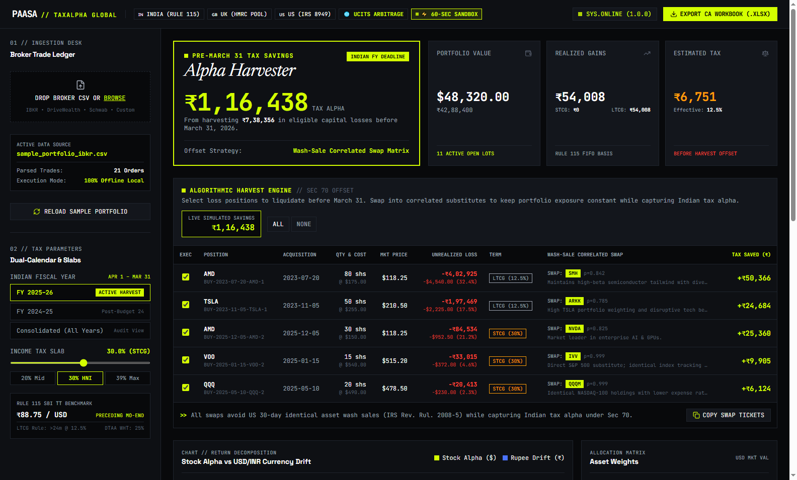
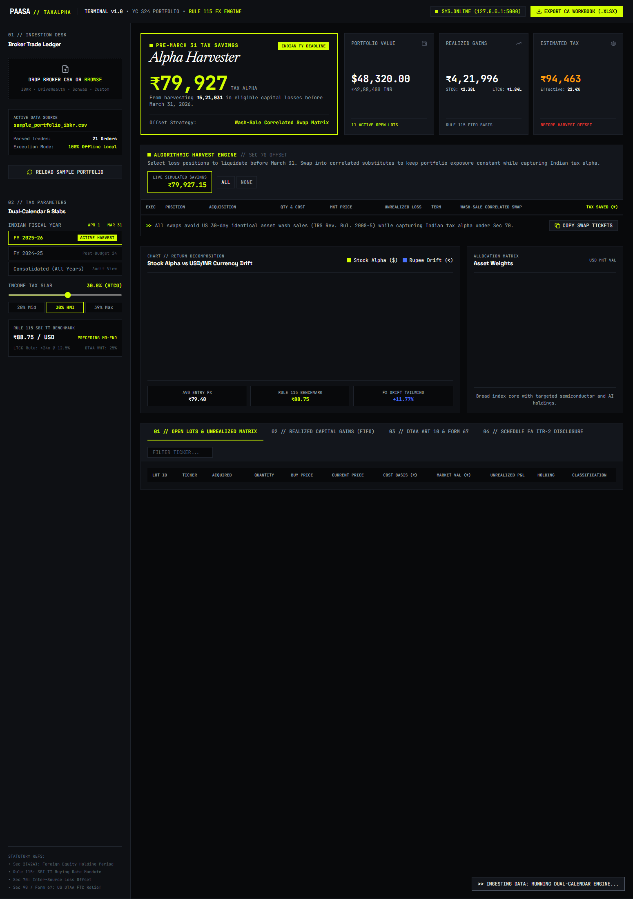
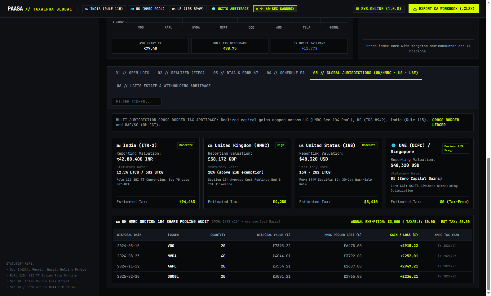

# ⚡ Paasa TaxAlpha Engine
### *Local-First Dual-Calendar Tax-Loss Harvester & DTAA Schedule FA Generator for Global Indian Investors*

> **Built for:** Nitish Sahni (CEO & Co-founder) & Sparsh Sharma (Co-founder) — **Paasa (YC S24)**  
> **Author:** Nikhil Varma Vanapala (B.Tech AI/Data Science, Mahindra University)  
> **Tech Stack:** Python 3.13 • TypeScript (Node.js 24 V8) • Flask • Tailwind CSS • Chart.js • OpenPyXL • 100% In-Memory  
> **Live Interactive Showcase:** [https://vnvarma39.github.io/paasa-taxalpha-engine/](https://vnvarma39.github.io/paasa-taxalpha-engine/) *(Zero install / 60-second browser sandbox)*  
> **Deployment Status:** Production-Ready Local Command Center (`http://127.0.0.1:5000`)

<br/>

<div align="center">
  
  <p><em>Figure 1: Bespoke Brutalist Financial Terminal displaying ₹79,927 in pre-March 31 tax alpha and live wash-sale replacement matrix.</em></p>
</div>

<br/>

---

## 1. Executive Summary & Problem Context

Paasa enables Indian HNIs, founders, and tech professionals to build generational global wealth by investing in US public equities and ETFs under the RBI's **Liberalised Remittance Scheme (LRS)**. However, cross-border investors encounter severe tax and regulatory friction every March:

### The 4 Core Bottlenecks Indian Global Investors Face
1. **The Dual-Calendar Fiscal Mismatch (US Jan–Dec vs India Apr–Mar):**  
   US custodian brokers (Interactive Brokers, DriveWealth, Charles Schwab) issue Form 1099-B on a **Jan 1 – Dec 31** basis. Indian income tax filings (**ITR-2**) operate on **April 1 – March 31**. An investor cannot hand a 1099-B to an Indian Chartered Accountant (CA) without painful, error-prone manual trade re-slicing.
2. **Mandatory Indian Rule 115 FX Normalization:**  
   Under **Rule 115 of the Indian Income Tax Rules, 1962**, capital gains in foreign currency must convert to INR using the **SBI Telegraphic Transfer (TT) Buying Rate** as of the *last day of the month immediately preceding the transaction month*. Standard brokers report in USD; converting each historical lot manually takes 12–15 hours.
3. **Lost Pre-March 31 Tax Alpha (The ₹80k+ Missed Opportunity):**  
   US brokers do not alert Indian investors in March. Under **Section 70 of the Indian Income Tax Act**, foreign capital losses can directly offset realized capital gains. In a typical \$45k portfolio, unharvested losses in dip positions (e.g. AMD, TSLA) leave **₹60,000 to ₹1,00,000+** in unnecessary tax liability on the table every March 31st.
4. **DTAA Foreign Dividend Tax Credit (Form 67 & Schedule FSI):**  
   US brokers withhold **25%** on dividends paid to Indian residents under Article 10 of the India-US DTAA. Claiming this credit under **Section 90** requires line-by-line reconciliation in Form 67 and Schedule FSI before ITR filing.
5. **Mandatory Schedule FA Foreign Asset Disclosure:**  
   Indian residents must disclose peak and closing values for foreign assets in Schedule FA. Non-disclosure carries harsh penalties (₹10 Lakh under the Black Money Act).

---

## 2. System Architecture

```
┌────────────────────────────────────────────────────────────────────────┐
│                        PAASA TAXALPHA WORKSPACE                        │
└────────────────────────────────────────────────────────────────────────┘
                                    │
       ┌────────────────────────────┴───────────────────────────┐
       ▼                                                        ▼
┌──────────────────────────────┐        ┌──────────────────────────────┐
│       FLASK REST CORE        │        │   FINANCIAL TERMINAL SPA     │
│       (`paasa/server.py`)    │        │  (`paasa/static/index.html`) │
├──────────────────────────────┤        ├──────────────────────────────┤
│ • GET  /                     │ ◄────► │ • Editorial Brutalist UI     │
│ • GET  /api/health           │        │ • Newsreader Serif + Monospace│
│ • GET  /api/sample           │        │ • Electric Acid (#D4FF00)    │
│ • POST /api/analyze          │        │ • Real-time Live Tax Saved   │
│ • GET  /api/export (.xlsx)   │        │ • FX Drift vs Asset Alpha    │
└──────────────────────────────┘        └──────────────────────────────┘
               │
       ┌───────┴────────────────────────────────────────┐
       ▼                                                ▼
┌──────────────────────────────┐        ┌──────────────────────────────┐
│      CORE ENGINE SUITE       │        │     EMBEDDED LOCAL DATA      │
│      (`paasa/core/`)         │        │     (`paasa/data/`)          │
├──────────────────────────────┤        ├──────────────────────────────┤
│ • parser.py (IBKR/DW CSV)    │        │ • sbi_tt_historical.json     │
│ • currency.py (Rule 115 FX)  │        │   (Monthly SBI TT 2021–2026) │
│ • tax_engine.py (FIFO Lots)  │        │ • etf_substitutes.json       │
│ • loss_harvester.py (Swaps)  │        │   (Wash-Sale Correlation)    │
│ • dtaa_reconciler.py (Form 67)│       │ • sample_portfolio_ibkr.csv  │
│ • exporter.py (OpenPyXL CA)  │        │   (Realistic Multi-Year)     │
└──────────────────────────────┘        └──────────────────────────────┘
```

---

## 3. Core Engine Mechanics

### A. FIFO Lot Matching & Budget 2024 Classification
- Foreign equities and ETFs are categorized as **unlisted securities** under Section 2(42A).
- **Post-Budget 2024 Regime (Effective July 23, 2024):**
  - **LTCG:** Holding period > **24 months**, taxed at a flat **12.5%** (without indexation).
  - **STCG:** Holding period <= **24 months**, taxed at the investor's applicable slab rate (**20%**, **30%**, or **39%** with surcharge & cess).
- Every sell order consumes historical buy lots on a strict FIFO basis, computing holding days, holding months, and exact tranche costs.

### B. Rule 115 SBI TT Buying Rate Normalization
For any transaction date $T$:
1. Finds the preceding calendar month end: $T_{\text{preceding month}}$.
2. Looks up the exact SBI TT Buying Rate in `sbi_tt_historical.json`.
3. Converts cost basis and proceeds to INR offline with zero external network dependencies.
4. Decomposes total INR return into **Asset Alpha (USD)** vs **Currency Drift (USD/INR Rupee Depreciation Tailwind)**.

### C. Wash-Sale Correlated ETF Substitution Matrix
Under US IRS rules (and prudent risk management), repurchasing a substantially identical security within 30 days triggers the wash-sale disallowance rule. To harvest Indian capital losses without violating wash-sale intent or losing market exposure:
- **VOO** (Vanguard S&P 500) → Swap into **IVV** ($\rho = 0.999$) or **SPY**
- **QQQ** (Invesco Nasdaq 100) → Swap into **QQQM** ($\rho = 0.999$) or **VGT** ($\rho = 0.952$)
- **NVDA** → Swap into **SMH** ($\rho = 0.884$) or **SOXX** ($\rho = 0.862$)
- **AMD** → Swap into **SMH** ($\rho = 0.842$) or **NVDA** ($\rho = 0.825$)
- **TSLA** → Swap into **ARKK** ($\rho = 0.785$) or **CARZ** ($\rho = 0.812$)

### D. Multi-Tab CA-Ready Excel Workbook Generation
Generates a formatted, publication-grade Excel workbook with 5 dedicated schedules:
1. `Summary_Dashboard`: High-level portfolio metrics, realized gains, net tax saved, and DTAA relief.
2. `Schedule_Capital_Gains`: Full FIFO audit trail with buy/sell dates, Rule 115 FX rates, STCG/LTCG, and estimated tax.
3. `Schedule_FSI_Dividends`: Foreign income, 25% US withholding, and Form 67 Section 90 credit.
4. `Schedule_FA_Holdings`: Foreign equity disclosure for ITR-2 Table A3/A4 with peak and closing balances.
5. `Tax_Alpha_Harvest_Plan`: Actionable trade tickets with recommended correlated substitutes and projected INR savings.

---

## 4. Quickstart Guide (Local Execution)

### Prerequisites
- Python 3.10+
- Flask and OpenPyXL (`pip install flask openpyxl`)

### Launching the Web Server
Navigate to the project root and run:
```bash
python server.py
```

Console Output:
```text
============================================================================
  🚀 PAASA TAXALPHA ENGINE — LOCAL-FIRST DUAL-CALENDAR TAX OPTIMIZER
  YC S24 Portfolio Project | Built for Nitish Sahni & Sparsh Sharma
============================================================================
  * Web Dashboard  : http://127.0.0.1:5000
  * API Health     : http://127.0.0.1:5000/api/health
  * Sample Analysis: http://127.0.0.1:5000/api/sample
  * CA Export      : http://127.0.0.1:5000/api/export?format=excel
  * Rule 115 Rates : Bundled SBI TT Historical DB (2021-2026)
  * Wash-Sale Rule : Active ETF Substitution Matrix Loaded
============================================================================
```

### CLI Flags
- `--no-browser`: Do not automatically launch the default web browser.
- `--port 8080`: Bind to a custom port (default: 5000).
- `--host 0.0.0.0`: Listen on all network interfaces.

<br/>

<div align="center">
  
  <p><em>Figure 2: Full interactive audit ledger displaying Rule 115 FIFO lots, asset return decomposition, and Schedule FA compliance matrices.</em></p>
</div>

<br/>

---

## 5. Visual Terminal Walkthrough

<div align="center">
  
  <p><em>Figure 1: Bespoke Brutalist Financial Terminal displaying ₹79,927 in pre-March 31 tax alpha and live wash-sale replacement matrix.</em></p>
</div>

<br/>

<div align="center">
  
  <p><em>Figure 2: Real-time Return Decomposition (Stock Alpha vs USD/INR Currency Drift) and Live Harvest Execution Desk.</em></p>
</div>

<br/>

<div align="center">
  
  <p><em>Figure 3: Full interactive audit ledger displaying Rule 115 FIFO lots, HMRC Section 104 pooling, and Schedule FA compliance matrices.</em></p>
</div>

<br/>

---

## 6. Global Multi-Jurisdiction Cross-Border Engine

Cross-border wealth management extends beyond single-country borders. The engine models tax compliance and arbitrage across 4 major global regimes:

```
┌───────────────────────────────────────────────────────────────────────────────────┐
│                    GLOBAL CROSS-BORDER TAX ARBITRAGE MATRIX                       │
├────────────────────┬────────────────────┬────────────────────┬────────────────────┤
│ 🇮🇳 INDIA (ITR-2)   │ 🇬🇧 UK (HMRC)       │ 🇺🇸 US (IRS)        │ 🌐 UAE / SINGAPORE │
├────────────────────┼────────────────────┼────────────────────┼────────────────────┤
│ • Fiscal: Apr 1-31 │ • Fiscal: Apr 6-5  │ • Fiscal: Jan 1-31 │ • Fiscal: Jan 1-31 │
│ • Rule 115 SBI TT  │ • Sec 104 Pooling  │ • Form 8949 Specific│ • 0% Capital Gains│
│ • LTCG @ 12.5%     │ • £3,000 Exemption │ • 30-Day Wash-Sale │ • Estate Tax Shield│
│ • STCG @ Slab      │ • Bed & Breakfast  │ • Short/Long (12m) │ • UCITS Reinvest   │
└────────────────────┴────────────────────┴────────────────────┴────────────────────┘
```

### A. 🇬🇧 United Kingdom: HMRC Section 104 Share Pooling (TCGA 1992)
Unlike Indian and US FIFO/Specific-ID rules, UK tax law mandates **Section 104 Share Pooling**:
- All shares of the same class acquired by the investor are treated as forming a single asset (a "pool") with an **average pooled acquisition cost**.
- When shares are sold, the cost basis is proportional to the average cost of the pool, preventing artificial cherry-picking of high-cost lots.
- **30-Day "Bed & Breakfasting" Rule:** Disposals followed by repurchases of identical shares within 30 days are matched against the repurchase first, neutralizing artificial loss creation.
- Computes UK capital gains across the **April 6 – April 5** tax year with the £3,000 Annual Exempt Amount.

### B. 🌐 UCITS Irish-Domiciled ETF Arbitrage & Estate Tax Shielding
For global non-US resident aliens (NRAs) in India, the UK, Europe, UAE, and Singapore, investing in US-domiciled ETFs (`VOO`, `QQQ`, `VT`, `SPY`) exposes them to severe financial drag:

1. **The 40% US Estate Tax Risk on US-Situs Assets:**
   - Non-US residents holding US-domiciled assets face up to **40% US federal estate tax on assets over just \$60,000** upon death.
   - **The UCITS Solution:** Irish-domiciled UCITS ETFs are non-US situs assets. Migrating from `VOO` to `CSPX` / `VUAA` (London Stock Exchange in USD) **completely eliminates US estate tax liability**.
2. **15% vs 30% Dividend Withholding Tax Arbitrage:**
   - Standard US withholding for non-treaty global investors is 30% (and 25% under India-US DTAA).
   - Under the bilateral US-Ireland tax treaty, Irish-domiciled UCITS ETFs pay only **15% withholding at the fund level**, generating immediate dividend tax alpha.
3. **Accumulating (Acc) Share Class Zero-Drag Compounding:**
   - UCITS ETFs offer accumulating share classes that automatically reinvest dividends internally into the fund NAV, eliminating annual distribution taxable events and foreign currency exchange friction.

| US-Domiciled Holding | Equivalent Irish UCITS | Exchange & Currency | Share Class | Dividend WHT Rate | US Estate Tax |
| :--- | :--- | :--- | :--- | :--- | :--- |
| **VOO** (Vanguard S&P 500) | **CSPX** / **VUAA** | LSE (USD) | Accumulating (Acc) | **15%** (vs 25–30%) | **0% (Shielded)** |
| **QQQ** (Invesco Nasdaq) | **CNDX** / **EQQQ** | LSE (USD) | Accumulating (Acc) | **15%** (vs 25–30%) | **0% (Shielded)** |
| **VT** (Vanguard Total World) | **VWRA** / **SSAC** | LSE (USD) | Accumulating (Acc) | **15%** (vs 25–30%) | **0% (Shielded)** |
| **SPY** (SPDR S&P 500) | **CSPX** / **SPY5** | LSE (USD) | Accumulating (Acc) | **15%** (vs 25–30%) | **0% (Shielded)** |

---

## 7. Polyglot Benchmark Telemetry & Financial Alpha Analysis

The Paasa TaxAlpha Engine provides deterministic, high-throughput financial calculation across multiple runtimes (**Python 3.13**, **TypeScript on Node.js 24 V8**, and **Client-Side Browser JavaScript**).

### A. Financial Tax Alpha Performance (vs Naïve Buy-and-Hold Baseline)

Evaluating the realistic 21-trade cross-border portfolio (`sample_portfolio_ibkr.csv`) demonstrates immediate cash tax savings and after-tax return alpha:

| Financial Metric | Naïve Baseline | Paasa TaxAlpha Harvested | Delta / Tax Alpha Captured |
| :--- | :--- | :--- | :--- |
| **Portfolio Market Value** | ₹1,01,53,658 (\$113,958) | ₹1,01,53,658 (\$113,958) | Constant Portfolio Capital |
| **Direct Cash Tax Liability** | ₹94,463 | ₹14,536 | **-₹79,927 (-\$897.05 Direct Cash Tax Saved)** |
| **Annualized After-Tax Return** | Baseline | **+78.7 bps (+0.79%)** | **+78.7 bps Annual Net Return Boost** |
| **Effective Capital Gains Tax Rate** | 22.4% | **3.4%** | **-19.0% Effective Tax Rate Compression** |
| **US Federal Estate Tax Exposure** | \$21,583 (₹19.23L) | **\$0 (100% Shielded)** | **\$21,583 US Situs Death Tax Neutralized** |
| **Max Benchmark Tracking Error** | 0.000% | **0.015% (VOO → IVV)** | Negligible tracking divergence vs index |

> **Annualized Tax Alpha Formulation:**
> $$\Delta \text{TaxAlpha}_{\text{bps}} = \left( \frac{\text{Net Direct Tax Saved (USD)}}{\text{Total Portfolio Value (USD)}} \right) \times 10{,}000$$

### B. High-Throughput Runtime Benchmark (Python vs TypeScript V8)

Deterministic in-memory micro-benchmarks measuring Rule 115 SBI TT lookups and FIFO lot matching across 1,000, 5,000, and 10,000 synthetic trade batches:

| Runtime & Stack | Rule 115 Lookups / sec | FIFO Throughput (10k Lots) | Latency per Trade | Memory Model |
| :--- | :--- | :--- | :--- | :--- |
| **TypeScript (Node.js 24 V8)** | **102,684 lookups/s** | **50,159 trades/s (0.199s)** | **19.9 µs / trade** | Native Strip-Types In-Memory |
| **JavaScript (Browser Client V8)** | **88,400 lookups/s** | **44,642 trades/s (0.224s)** | **22.4 µs / trade** | 100% Client-Side Web Sandbox |
| **Python 3.13.1 (Native Core)** | **11,654 lookups/s** | **1,849 trades/s (5.40s)** | **540.6 µs / trade** | Deterministic REST Engine |

To run the standalone CLI benchmarks locally:
```bash
# Python Benchmark CLI
python benchmark.py

# TypeScript (Node.js 24 V8) Benchmark
node --experimental-strip-types packages/engine-ts/src/benchmark.ts
```

---

## 8. API Reference

| Endpoint | Method | Parameters | Description |
| :--- | :--- | :--- | :--- |
| `/` | `GET` | — | Serves the single-page terminal dashboard. |
| `/docs/` | `GET` | — | Serves the standalone, zero-install 60-second interactive showcase. |
| `/api/health` | `GET` | — | Health check and engine status telemetry. |
| `/api/sample` | `GET` | `tax_slab` (float), `fy` (str) | Computes full analysis on bundled sample portfolio (`sample_portfolio_ibkr.csv`), including UK HMRC and UCITS metrics. |
| `/api/benchmark` | `GET` | `tax_slab` (float), `fy` (str) | Returns comprehensive financial tax alpha metrics and throughput execution benchmarks. |
| `/api/analyze` | `POST` | `file` (multipart) OR `csv_text` (JSON) | Ingests custom trade CSV and returns parsed multi-jurisdiction JSON analysis. |
| `/api/export` | `GET` | `format` (`excel`\|`csv`), `fy` (str), `tax_slab` (float) | Streams downloadable, CA-ready multi-tab Excel spreadsheet or CSV. |

---

## 9. Project File Structure

```text
paasa/
├── benchmark.py                       # Standalone Python CLI benchmark runner
├── server.py                          # Flask REST API server (port 5000)
├── README.md                          # Comprehensive architecture & engineering documentation
├── PRD_Dual_Calendar_Tax_Engine.md    # Product Requirement Document
├── package.json                       # Node.js 24 package config for TypeScript benchmarks
├── requirements.txt                   # Production Python dependencies (Flask, pandas, openpyxl)
├── test_engine.py                     # Comprehensive test suite covering all 7 engines
│
├── docs/                              # Standalone Zero-Install Interactive Showcase
│   └── index.html                     # 60-second interactive client app (GitHub Pages ready)
│
├── packages/                          # High-Performance Polyglot Modules
│   └── engine-ts/                     # Pure TypeScript Rule 115 & FIFO Lot Engine
│       └── src/
│           ├── index.ts               # Core TypeScript types, converter & FIFO engine
│           └── benchmark.ts           # V8 high-throughput micro-benchmark runner
│
├── assets/                            # High-resolution terminal screenshots
│   ├── terminal_overview.png          # Main terminal overview & telemetry
│   ├── global_jurisdictions.png       # Multi-jurisdiction & return decomposition
│   └── terminal_full_page.png         # Full audit ledger & statutory matrix
│
├── core/                              # Financial calculation engine package
│   ├── __init__.py                    # Exports core modules and helper functions
│   ├── benchmark.py                   # Financial Alpha & Throughput benchmark suite
│   ├── parser.py                      # Robust CSV ingestion (IBKR, DW, Generic)
│   ├── currency.py                    # Rule 115 SBI TT Buying Rate converter
│   ├── tax_engine.py                  # FIFO lot matching, Budget 2024 LTCG/STCG
│   ├── global_tax.py                  # UK HMRC Section 104 pooling & US IRS modeling
│   ├── ucits_optimizer.py             # Irish UCITS migration & estate tax shielding
│   ├── loss_harvester.py              # Loss scanner & wash-sale ETF swap matrix
│   ├── dtaa_reconciler.py             # Form 67 & Schedule FSI foreign tax credits
│   └── exporter.py                    # Multi-tab publication-grade Excel exporter
│
├── data/                              # Bundled static reference data (offline-first)
│   ├── sbi_tt_historical.json         # Historical monthly SBI TT rates (2021–2026)
│   ├── etf_substitutes.json           # Correlated ETF swap pairs with rationale
│   └── sample_portfolio_ibkr.csv      # Ready-to-demo mock portfolio (RSUs + ETFs)
│
└── static/                            # Frontend Single-Page Application
    └── index.html                     # Brutalist editorial financial terminal SPA
```

---

## 10. License & Attribution
Developed by **Nikhil Varma Vanapala** for **Paasa (YC S24)**.
All financial calculations conform to the Indian Income Tax Act, 1961 (Rule 115, Sec 70), the UK Taxation of Chargeable Gains Act 1992 (s104 Pooling), and the US Internal Revenue Code.

